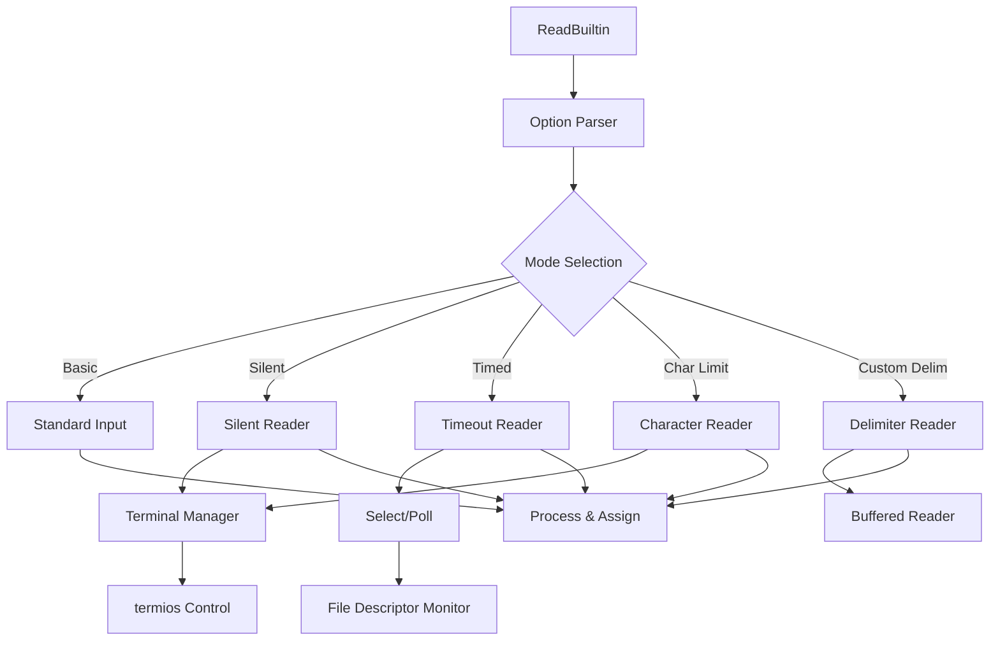

# Advanced Read Builtin Implementation Plan for PSH

## Overview

This document outlines the implementation plan for adding bash-compatible advanced features to PSH's read builtin:

1. **`-p prompt`**: Display a prompt before reading
2. **`-s`**: Silent mode (no echo) for password input
3. **`-t timeout`**: Time-limited input with automatic timeout
4. **`-n chars`**: Read exactly N characters
5. **`-d delimiter`**: Use custom delimiter instead of newline

## Current State Analysis

PSH already has:
- Basic read functionality with IFS-based field splitting
- Raw mode support (`-r` flag)
- Backslash escape processing
- Variable assignment mechanics
- A sophisticated line editor with terminal control capabilities

The `LineEditor` class already provides low-level terminal manipulation that we can leverage for the advanced features.

## Implementation Architecture



## Detailed Feature Specifications

### 1. Prompt Option (`-p prompt`)
- **Behavior**: Display prompt on stderr without trailing newline
- **Implementation**:
  ```python
  if prompt:
      sys.stderr.write(prompt)
      sys.stderr.flush()
  ```
- **Considerations**: Must work with all other options

### 2. Silent Mode (`-s`)
- **Behavior**: Don't echo typed characters (for passwords)
- **Implementation Strategy**:
  - Use termios to disable echo
  - Save and restore terminal settings
  - Ensure cleanup on interruption
  ```python
  def _read_silent(self, fd: int) -> str:
      old_settings = termios.tcgetattr(fd)
      try:
          tty.setraw(fd)
          new_settings = termios.tcgetattr(fd)
          new_settings[3] &= ~termios.ECHO  # Disable echo
          termios.tcsetattr(fd, termios.TCSADRAIN, new_settings)
          # Read input...
      finally:
          termios.tcsetattr(fd, termios.TCSADRAIN, old_settings)
  ```

### 3. Timeout (`-t timeout`)
- **Behavior**: Return after timeout seconds with exit code 142
- **Implementation Strategy**:
  - Use `select.select()` for timeout handling
  - Support fractional seconds
  ```python
  def _read_with_timeout(self, fd: int, timeout: float) -> Optional[str]:
      ready, _, _ = select.select([fd], [], [], timeout)
      if not ready:
          return None  # Timeout
      # Continue reading...
  ```

### 4. Character Limit (`-n chars`)
- **Behavior**: Read exactly N characters (stop early on delimiter)
- **Implementation Strategy**:
  - Use raw terminal mode for character-by-character reading
  - Stop at N characters or delimiter
  ```python
  def _read_n_chars(self, fd: int, n: int, delimiter: str) -> str:
      chars = []
      with TerminalManager() as term:
          for _ in range(n):
              char = os.read(fd, 1).decode('utf-8', errors='replace')
              if not char or char == delimiter:
                  break
              chars.append(char)
      return ''.join(chars)
  ```

### 5. Custom Delimiter (`-d delim`)
- **Behavior**: Use specified delimiter instead of newline
- **Special Cases**:
  - Empty string means null-terminated
  - First character of multi-char string is used
- **Implementation**: Modify reading loop to check for custom delimiter

## Implementation Phases

### Phase 1: Foundation (Prompt & Silent Mode)
1. **Extend option parsing** to handle new flags
2. **Implement `-p` prompt option** (simplest feature)
3. **Create terminal control utilities** for raw mode handling
4. **Implement `-s` silent mode** with proper cleanup

### Phase 2: Advanced Input Control
1. **Implement `-n` character limit** using raw terminal mode
2. **Add `-d` custom delimiter** support
3. **Ensure combinations work** (e.g., `-sn 8` for 8-char password)

### Phase 3: Timeout Support
1. **Implement `-t` timeout** using select()
2. **Handle timeout edge cases** (partial input, cleanup)
3. **Add timeout support to all reading modes**

## Code Structure

```python
# psh/builtins/read_builtin.py additions

import select
import termios
import tty
from contextlib import contextmanager

class ReadBuiltin(Builtin):
    @contextmanager
    def _terminal_raw_mode(self, fd: int, echo: bool = True):
        """Context manager for raw terminal mode."""
        old_settings = termios.tcgetattr(fd)
        try:
            tty.setraw(fd)
            if not echo:
                new_settings = termios.tcgetattr(fd)
                new_settings[3] &= ~termios.ECHO
                termios.tcsetattr(fd, termios.TCSADRAIN, new_settings)
            yield
        finally:
            termios.tcsetattr(fd, termios.TCSADRAIN, old_settings)
    
    def _parse_options(self, args: List[str]) -> Tuple[dict, List[str]]:
        """Parse read command options."""
        options = {
            'raw_mode': False,
            'silent': False,
            'prompt': None,
            'timeout': None,
            'max_chars': None,
            'delimiter': '\n',
            'fd': 0
        }
        
        i = 1
        while i < len(args):
            if args[i] == '-r':
                options['raw_mode'] = True
            elif args[i] == '-s':
                options['silent'] = True
            elif args[i] == '-p' and i + 1 < len(args):
                options['prompt'] = args[i + 1]
                i += 1
            elif args[i] == '-t' and i + 1 < len(args):
                try:
                    options['timeout'] = float(args[i + 1])
                except ValueError:
                    raise ValueError(f"read: {args[i + 1]}: invalid timeout specification")
                i += 1
            elif args[i] == '-n' and i + 1 < len(args):
                try:
                    options['max_chars'] = int(args[i + 1])
                except ValueError:
                    raise ValueError(f"read: {args[i + 1]}: invalid number")
                i += 1
            elif args[i] == '-d' and i + 1 < len(args):
                # Use first character of delimiter string, empty means null
                options['delimiter'] = args[i + 1][0] if args[i + 1] else '\0'
                i += 1
            elif args[i].startswith('-'):
                raise ValueError(f"read: {args[i]}: invalid option")
            else:
                break
            i += 1
        
        var_names = args[i:] if i < len(args) else ['REPLY']
        return options, var_names
```

## Testing Strategy

### Unit Tests
- Each option individually
- Common option combinations  
- Error cases and edge conditions

### Integration Tests
```bash
# Password prompt
read -sp "Password: " pass && echo

# Timed input
if read -t 5 -p "Answer in 5 seconds: " answer; then
    echo "You said: $answer"
else
    echo "Timeout!"
fi

# Fixed-length input
read -n 4 -p "Enter 4-digit PIN: " pin

# Custom delimiter
IFS= read -d '' -r content < file.txt
```

### Compatibility Tests
- Compare behavior with bash
- Test signal handling during read
- Verify terminal state restoration

## Implementation Considerations

### Signal Handling
- Properly restore terminal settings on SIGINT
- Handle SIGWINCH (window resize) gracefully

### File Descriptor Support
- Currently hardcoded to stdin (fd 0)
- Future: add `-u fd` option for arbitrary file descriptors

### Performance
- Character-by-character reading is slower
- Buffer when possible, use raw mode only when necessary

### Compatibility
- Match bash exit codes (142 for timeout)
- Error messages should match bash format
- Handle platform differences (select vs poll)

## Success Metrics

1. All specified options work correctly
2. Options can be combined sensibly
3. Terminal state is never left corrupted
4. Performance is acceptable for interactive use
5. Error handling matches bash behavior
6. Comprehensive test coverage (>95%)

## Future Extensions

After implementing these core features, consider:
- `-u fd`: Read from specific file descriptor
- `-a array`: Read into array variable (requires array support)
- `-e`: Use readline for enhanced editing
- `-i text`: Provide initial text for editing

## Examples to Support

```bash
# Basic password prompt
read -s -p "Password: " password
echo

# Timed yes/no prompt
if read -t 10 -p "Continue? (y/n) " -n 1 answer; then
    echo
    [[ $answer == [yY] ]] && echo "Continuing..."
else
    echo -e "\nTimeout - aborting"
fi

# Read until null character
while IFS= read -r -d '' file; do
    echo "Found: $file"
done < <(find . -type f -print0)

# PIN entry with exact length
read -s -p "Enter 4-digit PIN: " -n 4 pin
echo

# Multi-field CSV parsing with custom delimiter
while IFS=',' read -r name age city; do
    echo "Name: $name, Age: $age, City: $city"
done < data.csv
```

This plan provides a solid foundation for implementing bash-compatible advanced read features while maintaining the educational clarity of the PSH codebase.