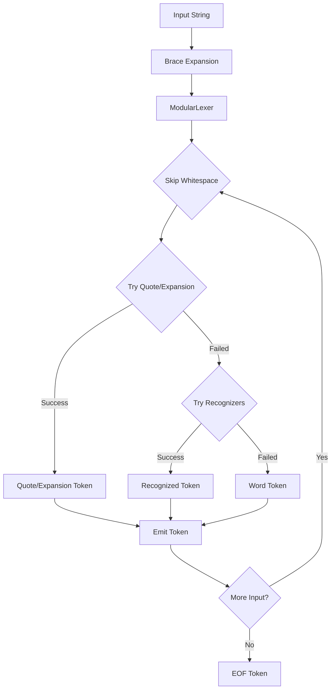

# PSH Lexer Architecture Documentation

## Overview

The PSH lexer is a modular tokenization system designed to handle the complex syntax of POSIX shells while maintaining clarity and extensibility.

## Architecture Principles

1. **Modularity**: Components are loosely coupled with well-defined interfaces
2. **Extensibility**: New token types and recognizers can be added without modifying core logic
3. **Context Awareness**: Rich metadata and state tracking throughout tokenization
4. **Error Recovery**: Graceful handling of malformed input with detailed error context
5. **Performance**: Efficient token recognition with priority-based dispatch
6. **Clarity**: Clean separation of concerns with modular architecture

## Architecture Diagram

```
┌─────────────────────────────────────────────────────────────────┐
│                         Input String                             │
└─────────────────────────────────────┬───────────────────────────┘
                                      │
                                      ▼
┌─────────────────────────────────────────────────────────────────┐
│                      Position Tracker                            │
│  - Line/column tracking                                          │
│  - Unicode-aware positioning                                     │
│  - Error location reporting                                      │
└─────────────────────────────────────┬───────────────────────────┘
                                      │
                                      ▼
┌─────────────────────────────────────────────────────────────────┐
│                    State Management Layer                        │
│  ┌─────────────────┐  ┌──────────────┐  ┌─────────────────┐   │
│  │  LexerContext   │  │ StateManager │  │ TransitionTable │   │
│  │  - Unified state│  │ - History    │  │ - State rules   │   │
│  │  - Nesting info │  │ - Transitions│  │ - Priorities    │   │
│  └─────────────────┘  └──────────────┘  └─────────────────┘   │
└─────────────────────────────────────┬───────────────────────────┘
                                      │
                                      ▼
┌─────────────────────────────────────────────────────────────────┐
│                    Recognition Pipeline                          │
│  ┌─────────────────────────────────────────────────────────┐   │
│  │              Quote & Expansion Parsers                   │   │
│  │  ┌──────────────────┐  ┌─────────────────────────┐     │   │
│  │  │ UnifiedQuoteParser│  │   ExpansionParser      │     │   │
│  │  │ - Single quotes   │  │ - Variables ($VAR)     │     │   │
│  │  │ - Double quotes   │  │ - Parameters (${VAR})  │     │   │
│  │  │ - ANSI-C quotes  │  │ - Command sub $(...)   │     │   │
│  │  └──────────────────┘  │ - Arithmetic $((...)    │     │   │
│  │                         │ - Process sub <(...) >(..)    │   │
│  │                         └─────────────────────────┘     │   │
│  └─────────────────────────────────────────────────────────┘   │
│                                                                  │
│  ┌─────────────────────────────────────────────────────────┐   │
│  │            Modular Token Recognizers                     │   │
│  │  ┌────────────────┐  ┌────────────────┐  ┌────────────┐│   │
│  │  │Process Sub Rec │  │  Operator Rec  │  │Keyword Rec ││   │
│  │  │ Priority: 160  │  │ Priority: 100  │  │Priority: 80││   │
│  │  └────────────────┘  └────────────────┘  └────────────┘│   │
│  │  ┌────────────────┐  ┌────────────────┐  ┌────────────┐│   │
│  │  │ Literal Rec    │  │ Comment Rec    │  │Whitespace  ││   │
│  │  │ Priority: 70   │  │ Priority: 60   │  │Priority: 30││   │
│  │  └────────────────┘  └────────────────┘  └────────────┘│   │
│  └─────────────────────────────────────────────────────────┘   │
│                                                                  │
│  ┌─────────────────────────────────────────────────────────┐   │
│  │              Recognizer Registry                         │   │
│  │  - Priority-based dispatch                               │   │
│  │  - Dynamic registration                                  │   │
│  │  - Error handling                                        │   │
│  └─────────────────────────────────────────────────────────┘   │
└─────────────────────────────────────┬───────────────────────────┘
                                      │
                                      ▼
┌─────────────────────────────────────────────────────────────────┐
│                     Unified Token Stream                         │
│  - Single Token class with built-in metadata                     │
│  - Context tracking and semantic information                     │
│  - Position information (line, column, offset)                   │
│  - Token parts for composite tokens                              │
└─────────────────────────────────────────────────────────────────┘
```

## Component Architecture

### 1. Core Components

#### ModularLexer (`modular_lexer.py`)
The main orchestrator that coordinates all tokenization activities:
- Manages input position and state
- Integrates quote/expansion parsing with token recognition
- Emits tokens with comprehensive metadata
- Handles error recovery and reporting

```python
class ModularLexer:
    """Main lexer combining modular recognition with unified parsing"""
    def __init__(self, input_string: str, config=None):
        self.config = config or LexerConfig()
        self.position_tracker = PositionTracker(input_string)
        self.registry = RecognizerRegistry()
        self.expansion_parser = ExpansionParser(self.config)
        self.quote_parser = UnifiedQuoteParser(self.expansion_parser)
```

#### LexerContext (`state_context.py`)
Unified state representation that replaced scattered boolean flags:
- Tracks nesting depth for various constructs
- Manages command position and test context
- Supports context stacking for nested structures

```python
@dataclass
class LexerContext:
    """Unified state representation for the lexer"""
    bracket_depth: int = 0          # Tracks [ ] nesting
    paren_depth: int = 0           # Tracks ( ) nesting
    brace_depth: int = 0           # Tracks { } nesting
    double_bracket_depth: int = 0  # Tracks [[ ]] nesting
    in_quote: Optional[str] = None
    in_expansion: bool = False
    is_command_position: bool = True
    in_test_expr: bool = False
    in_regex_context: bool = False
```

### 2. Token Recognition System

#### Recognizer Framework (`recognizers/`)
Implements a pluggable, priority-based token recognition system:

```python
class TokenRecognizer(ABC):
    """Base class for all token recognizers"""
    @property
    @abstractmethod
    def priority(self) -> int:
        """Recognition priority (higher = checked first)"""
        pass
    
    @abstractmethod
    def can_recognize(self, char: str, context: LexerContext) -> bool:
        """Check if this recognizer can handle the current character"""
        pass
    
    @abstractmethod
    def recognize(self, lexer: 'ModularLexer', char: str) -> Optional[Token]:
        """Attempt to recognize and return a token"""
        pass
```

#### RecognizerRegistry (`recognizers/registry.py`)
Manages recognizer registration and dispatch:
- Priority-based ordering (process substitution: 160, operators: 100, keywords: 80)
- Context-aware selection
- Efficient lookup mechanisms
- Error recovery strategies

### 3. Quote and Expansion Parsing

#### UnifiedQuoteParser (`quote_parser.py`)
Handles all quote types with configurable rules:
- Single quotes (no expansions)
- Double quotes (allow expansions)
- ANSI-C quotes ($'...' with escape sequences)
- Quote removal and escape processing

```python
QUOTE_RULES = {
    "'": QuoteRules(
        allow_expansions=False,
        allow_escapes=False,
        escape_chars=set(),
        name="single"
    ),
    '"': QuoteRules(
        allow_expansions=True,
        allow_escapes=True,
        escape_chars={'$', '`', '"', '\\', '\n'},
        name="double"
    )
}
```

#### ExpansionParser (`expansion_parser.py`)
Parses shell expansions within appropriate contexts:
- Variable expansions: `$VAR`, `${VAR}`
- Command substitution: `$(...)`, `` `...` ``
- Arithmetic expansion: `$((...))`
- Process substitution: `<(...)`, `>(...)`

### 4. Supporting Infrastructure

#### Position Tracking (`position.py`)
Maintains accurate position information:
- Line and column tracking
- Position snapshots for error reporting
- Efficient position updates
- Unicode-aware character counting

#### Token Parts (`token_parts.py`)
Represents fine-grained token components:
```python
@dataclass
class TokenPart:
    """Represents a part of a composite token"""
    type: PartType
    value: str
    original: str
    quote_context: Optional[str] = None
    is_variable: bool = False
    is_expansion: bool = False
    expansion_type: Optional[str] = None
    error_message: Optional[str] = None
    start_position: int = 0
    end_position: int = 0
```

#### Unicode Support (`unicode_support.py`)
Provides character classification functions:
- POSIX mode vs Unicode mode
- Identifier validity checking
- Whitespace detection across Unicode categories
- Variable name validation

## Unified Token System (v0.91.3)

The unified token system represents the culmination of the Enhanced Lexer Deprecation Plan:

### Token Class Unification
```python
@dataclass
class Token:
    """Unified token class with metadata and context information"""
    type: TokenType
    value: str
    position: int
    end_position: int = 0
    quote_type: Optional[str] = None
    line: Optional[int] = None
    column: Optional[int] = None
    metadata: Optional['TokenMetadata'] = field(default=None)
    parts: Optional[List['TokenPart']] = field(default=None)
```

### Enhanced Features as Standard
- **Built-in Metadata**: Every token includes rich metadata by default
- **Context Tracking**: Semantic information available for all tokens
- **Position Information**: Line/column/offset tracking standard
- **Token Parts**: Composite token support built-in
- **No Compatibility Overhead**: Single implementation path

## Token Generation Flow



## Key Design Patterns

### 1. Registry Pattern
The `RecognizerRegistry` implements dynamic registration with priority-based dispatch:
```python
registry = RecognizerRegistry()
registry.register(ProcessSubstitutionRecognizer())  # Priority: 160
registry.register(OperatorRecognizer())            # Priority: 100
registry.register(KeywordRecognizer())             # Priority: 80
registry.register(LiteralRecognizer())             # Priority: 70
registry.register(CommentRecognizer())             # Priority: 60
registry.register(WhitespaceRecognizer())          # Priority: 30
```

### 2. Strategy Pattern
Quote parsing uses configurable rules for different quote types, allowing easy extension.

### 3. Context Object Pattern
`LexerContext` consolidates state to avoid parameter explosion and enable clean APIs.


## Configuration System

The lexer supports comprehensive configuration through `LexerConfig`:
```python
@dataclass
class LexerConfig:
    """Configuration for lexer behavior"""
    enable_history_expansion: bool = True
    enable_process_substitution: bool = True
    enable_extended_globbing: bool = False
    enable_bash_specific: bool = True
    posix_mode: bool = False
    interactive_mode: bool = False
    strict_mode: bool = False
    max_nesting_depth: int = 100
    unicode_identifiers: bool = True
```

## Error Handling

The lexer implements sophisticated error handling:
- `LexerError`: Unrecoverable errors requiring termination
- `RecoverableLexerError`: Errors that can be recovered in interactive mode
- Rich error context with position information
- Clear error messages for common issues
- Synchronization points for error recovery

## Token Metadata

Every token includes comprehensive metadata through the unified system:
- Position information (line, column, offset)
- Quote context and nesting depth
- Expansion depth and type
- Semantic type hints
- Command position indicators
- Error information for invalid constructs

## Performance Optimizations

1. **Priority-based dispatch**: Most common tokens checked first
2. **Character-based early exit**: Quick rejection of impossible tokens
3. **Minimal state copying**: Efficient context management
4. **Lazy metadata creation**: Only populated when needed
5. **String view operations**: Avoid unnecessary string copies
6. **Greedy operator matching**: Longest match first

## Testing Strategy

The modular architecture facilitates comprehensive testing:

### Unit Tests
- State management: Context tracking and transitions
- Pure helpers: All utility functions tested independently
- Quote/expansion parsing: Edge cases and error conditions
- Token recognition: Each recognizer tested in isolation

### Integration Tests
- End-to-end tokenization scenarios
- Cross-component interactions
- Error recovery paths
- Performance benchmarks

### Conformance Tests
- POSIX compliance verification
- Bash compatibility testing
- Token output comparison with reference implementations

## Extension Points

The architecture provides clear extension points:

### 1. New Token Types
```python
# Add to TokenType enum
NEW_TOKEN = auto()

# Create recognizer
class NewTokenRecognizer(TokenRecognizer):
    priority = 85
    
    def can_recognize(self, char, context):
        return char == '@' and context.is_special_mode
    
    def recognize(self, lexer, char):
        # Recognition logic
        return Token(TokenType.NEW_TOKEN, value, position)

# Register
registry.register(NewTokenRecognizer())
```

### 2. New Quote Types
Extend `QUOTE_RULES` dictionary with custom quote behavior.

### 3. New Expansions
Extend `ExpansionParser` with new expansion types.

### 4. Context Extensions
Add fields to `LexerContext` for new state tracking needs.

## Future Directions

The architecture is designed to support:
- Incremental parsing for better error recovery
- Parallel tokenization for performance
- Language server protocol integration
- Advanced syntax highlighting
- Custom shell dialects
- Real-time tokenization for interactive features

## Conclusion

The PSH lexer architecture represents a maintainable approach to shell tokenization. Its modular design, metadata, and extension points make it a good foundation for both educational purposes and practical shell implementation.

