# Comprehensive Advanced Parameter Expansion Implementation Plan

## Overview

This document outlines the implementation plan for adding advanced parameter expansion features to psh (Python Shell). These features will significantly enhance the shell's string manipulation capabilities, making it more powerful for scripting and interactive use.

## Complete Feature Set

The following features will be implemented:

### 1. Length Operations
- `${#var}` - String length of variable
- `${#}` - Number of positional parameters (special case)
- `${#*}` or `${#@}` - Length of positional parameters as string

### 2. Pattern Removal Operations
- `${var#pattern}` - Remove shortest matching prefix
- `${var##pattern}` - Remove longest matching prefix
- `${var%pattern}` - Remove shortest matching suffix
- `${var%%pattern}` - Remove longest matching suffix

### 3. Pattern Substitution
- `${var/pattern/string}` - Replace first match
- `${var//pattern/string}` - Replace all matches
- `${var/#pattern/string}` - Replace prefix match
- `${var/%pattern/string}` - Replace suffix match

### 4. Substring Extraction
- `${var:offset}` - Extract substring from offset to end
- `${var:offset:length}` - Extract substring of specified length
- Negative offsets and lengths supported

### 5. Variable Name Matching
- `${!prefix*}` - List all variable names starting with prefix
- `${!prefix@}` - Same as above but with quoted output

### 6. Case Modification
- `${var^pattern}` - Convert first matching char to uppercase
- `${var^^pattern}` - Convert all matching chars to uppercase
- `${var,pattern}` - Convert first matching char to lowercase
- `${var,,pattern}` - Convert all matching chars to lowercase
- Pattern defaults to `?` (any character) if omitted

## Architecture Diagram

```mermaid
graph TD
    A[Advanced Parameter Expansion] --> B[Length Operations]
    A --> C[Pattern Removal]
    A --> D[Pattern Substitution]
    A --> E[Substring Extraction]
    A --> F[Variable Name Matching]
    A --> G[Case Modification]
    
    B --> B1["${#var} - String length"]
    
    C --> C1["${var#pattern} - Remove shortest prefix"]
    C --> C2["${var##pattern} - Remove longest prefix"]
    C --> C3["${var%pattern} - Remove shortest suffix"]
    C --> C4["${var%%pattern} - Remove longest suffix"]
    
    D --> D1["${var/pattern/string} - Replace first"]
    D --> D2["${var//pattern/string} - Replace all"]
    D --> D3["${var/#pattern/string} - Replace prefix"]
    D --> D4["${var/%pattern/string} - Replace suffix"]
    
    E --> E1["${var:offset} - Substring from offset"]
    E --> E2["${var:offset:length} - Substring with length"]
    
    F --> F1["${!prefix*} - Names matching prefix"]
    F --> F2["${!prefix@} - Names matching prefix (quoted)"]
    
    G --> G1["${var^pattern} - Uppercase first match"]
    G --> G2["${var^^pattern} - Uppercase all matches"]
    G --> G3["${var,pattern} - Lowercase first match"]
    G --> G4["${var,,pattern} - Lowercase all matches"]
```



## Implementation Architecture

### New Module Structure

```python
# psh/expansion/parameter_expansion.py

class ParameterExpansion:
    """Advanced parameter expansion operations"""
    
    def __init__(self, shell):
        self.shell = shell
        self.state = shell.state
    
    # Length operations
    def get_length(self, value: str) -> str
    
    # Pattern removal
    def remove_shortest_prefix(self, value: str, pattern: str) -> str
    def remove_longest_prefix(self, value: str, pattern: str) -> str
    def remove_shortest_suffix(self, value: str, pattern: str) -> str
    def remove_longest_suffix(self, value: str, pattern: str) -> str
    
    # Pattern substitution
    def substitute_first(self, value: str, pattern: str, replacement: str) -> str
    def substitute_all(self, value: str, pattern: str, replacement: str) -> str
    def substitute_prefix(self, value: str, pattern: str, replacement: str) -> str
    def substitute_suffix(self, value: str, pattern: str, replacement: str) -> str
    
    # Substring extraction
    def extract_substring(self, value: str, offset: int, length: int = None) -> str
    
    # Variable name matching
    def match_variable_names(self, prefix: str, quoted: bool = False) -> List[str]
    
    # Case modification
    def uppercase_first(self, value: str, pattern: str = '?') -> str
    def uppercase_all(self, value: str, pattern: str = '?') -> str
    def lowercase_first(self, value: str, pattern: str = '?') -> str
    def lowercase_all(self, value: str, pattern: str = '?') -> str
```

### Pattern Matching Infrastructure

```python
# psh/expansion/pattern_matcher.py

class PatternMatcher:
    """Convert shell patterns to regex and perform matching"""
    
    def shell_pattern_to_regex(self, pattern: str) -> str:
        """Convert shell glob pattern to Python regex"""
        
    def find_shortest_match(self, text: str, pattern: str, from_start: bool) -> Optional[Match]:
        """Find shortest match from start or end"""
        
    def find_longest_match(self, text: str, pattern: str, from_start: bool) -> Optional[Match]:
        """Find longest match from start or end"""
        
    def find_all_matches(self, text: str, pattern: str) -> List[Match]:
        """Find all matches in text"""
```

## Implementation Phases

### Phase 1: Infrastructure Setup (Week 1)

1. **Create Parameter Expansion Parser**
   - Parse complex `${...}` expressions
   - Identify operator type and operands
   - Handle nested expansions

2. **Pattern Matching Engine**
   - Convert shell patterns to regex
   - Support *, ?, [...] patterns
   - Handle escaped characters

3. **Update VariableExpander**
   - Integrate with new ParameterExpansion class
   - Route complex expansions appropriately
   - Maintain backward compatibility

### Phase 2: Core Features (Weeks 2-3)

#### String Length Implementation
```python
# Examples:
PATH="/usr/bin:/bin"
echo ${#PATH}           # Output: 13
echo ${#}               # Number of positional parameters
echo ${#@}              # Length of "$@" expansion
```

#### Pattern Removal Operations
```python
# Prefix removal:
file="/home/user/document.txt"
echo ${file#*/}         # "home/user/document.txt" (shortest)
echo ${file##*/}        # "document.txt" (longest)

# Suffix removal:
echo ${file%.*}         # "/home/user/document" (shortest)
echo ${file%%/*}        # "" (longest)

# Real-world usage:
basename=${file##*/}    # Extract filename
dirname=${file%/*}      # Extract directory
name_only=${file%.*}    # Remove extension
```

#### Pattern Substitution
```python
# Basic substitution:
path="/usr/local/bin:/usr/bin:/bin"
echo ${path/:/,}        # "/usr/local/bin,/usr/bin:/bin" (first)
echo ${path//:/,}       # "/usr/local/bin,/usr/bin,/bin" (all)

# Anchored substitution:
echo ${path/#\/usr/\/opt}   # "/opt/local/bin:/usr/bin:/bin" (prefix)
echo ${path/%bin/sbin}      # "/usr/local/bin:/usr/bin:/sbin" (suffix)

# Special patterns:
text="hello world"
echo ${text// /_}       # "hello_world" (replace spaces)
```

### Phase 3: Extended Features (Week 4)

#### Substring Extraction
```python
# Basic extraction:
str="Hello, World!"
echo ${str:7}           # "World!"
echo ${str:7:5}         # "World"

# Negative offsets:
echo ${str: -6}         # "World!" (from end)
echo ${str: -6:5}       # "World"

# Negative length:
echo ${str:0:-1}        # "Hello, World" (all but last char)
```

#### Variable Name Matching
```python
# List variables:
USER=john
USER_ID=1000
USER_HOME=/home/john

echo ${!USER*}          # "USER USER_ID USER_HOME"
echo ${!USER@}          # "USER" "USER_ID" "USER_HOME" (quoted)

# Practical usage:
for var in ${!LC_*}; do
    echo "$var=${!var}"
done
```

#### Case Modification
```python
# Basic case conversion:
text="hello WORLD"
echo ${text^}           # "Hello WORLD" (first char upper)
echo ${text^^}          # "HELLO WORLD" (all upper)
echo ${text,}           # "hello WORLD" (first char lower)
echo ${text,,}          # "hello world" (all lower)

# Pattern-based:
echo ${text^[aeiou]}    # "hEllo WORLD" (first vowel upper)
echo ${text^^[aeiou]}   # "hEllO WORLD" (all vowels upper)

# Practical usage:
read -p "Continue? (yes/no): " answer
if [[ ${answer,,} == "yes" ]]; then
    echo "Continuing..."
fi
```

### Phase 4: Edge Cases and Error Handling (Week 5)

1. **Enhanced Error Messages**
   ```
   psh: ${var:bad}: invalid offset: must be integer
   psh: ${var/}: missing pattern in substitution
   psh: ${!}: invalid variable name pattern
   psh: ${var:10:bad}: invalid length: must be integer
   ```

2. **Special Cases to Handle**
   - Undefined variables (usually treated as empty string)
   - Empty patterns in substitution
   - Out-of-bounds substring operations
   - Unicode string handling
   - Nested parameter expansions

3. **Performance Considerations**
   - Cache compiled regex patterns
   - Optimize common operations
   - Avoid unnecessary string copies

## Test Strategy

### Unit Test Structure

```python
# tests/test_parameter_expansion.py

class TestStringLength:
    def test_simple_length(self)
    def test_undefined_variable_length(self)
    def test_special_variables_length(self)
    def test_positional_params_length(self)
    def test_unicode_length(self)

class TestPatternRemoval:
    def test_shortest_prefix_removal(self)
    def test_longest_prefix_removal(self)
    def test_shortest_suffix_removal(self)
    def test_longest_suffix_removal(self)
    def test_no_match_returns_original(self)
    def test_glob_patterns(self)
    def test_escaped_characters(self)

class TestPatternSubstitution:
    def test_first_match_replacement(self)
    def test_all_matches_replacement(self)
    def test_prefix_replacement(self)
    def test_suffix_replacement(self)
    def test_empty_pattern_behavior(self)
    def test_special_chars_in_replacement(self)
    def test_empty_replacement(self)

class TestSubstringExtraction:
    def test_positive_offset(self)
    def test_negative_offset(self)
    def test_offset_with_length(self)
    def test_negative_length(self)
    def test_out_of_bounds_handling(self)
    def test_unicode_substring(self)

class TestVariableNameMatching:
    def test_prefix_matching(self)
    def test_quoted_output(self)
    def test_no_matches(self)
    def test_special_variable_exclusion(self)
    def test_empty_prefix(self)

class TestCaseModification:
    def test_first_char_upper(self)
    def test_all_chars_upper(self)
    def test_first_char_lower(self)
    def test_all_chars_lower(self)
    def test_pattern_based_modification(self)
    def test_unicode_handling(self)
    def test_empty_string(self)
```

### Integration Test Examples

```bash
#!/usr/bin/env psh
# tests/scripts/test_param_expansion.sh

# Filename manipulation
process_file() {
    local file="$1"
    echo "Processing: $file"
    echo "  Directory: ${file%/*}"
    echo "  Filename: ${file##*/}"
    echo "  Extension: ${file##*.}"
    echo "  Without ext: ${file%.*}"
    echo "  Base name: ${file##*/}; ${_%.* }"
}

# Path manipulation
add_to_path() {
    local new_path="$1"
    # Only add if not already in PATH
    if [[ ":$PATH:" != *":$new_path:"* ]]; then
        export PATH="${PATH}${PATH:+:}$new_path"
    fi
}

# Case-insensitive comparison
confirm() {
    local prompt="$1"
    local response
    read -p "$prompt (yes/no): " response
    [[ ${response,,} == "yes" ]]
}

# Configuration processing
process_config() {
    # Remove comments and empty lines
    local line
    while read line; do
        line=${line%%#*}  # Remove comments
        line=${line##*( )}  # Trim leading whitespace
        line=${line%%*( )}  # Trim trailing whitespace
        [[ -n $line ]] && echo "$line"
    done
}
```

## Documentation Plan

### User Documentation Structure

1. **Overview**
   - What is parameter expansion?
   - Why use advanced parameter expansion?
   - Quick reference table

2. **Detailed Syntax Reference**
   - Each operator with full syntax
   - Parameter descriptions
   - Return value explanations

3. **Examples and Use Cases**
   - Common patterns for each feature
   - Real-world scenarios
   - Best practices

4. **Differences from Bash**
   - Clearer error messages
   - Any simplified behaviors
   - Unicode handling improvements

5. **Troubleshooting Guide**
   - Common errors and solutions
   - Performance tips
   - Debugging techniques

## Implementation Timeline

### Week 1: Foundation
- Day 1-2: Parameter expansion parser
- Day 3-4: Pattern matching infrastructure
- Day 5: String length operation and basic tests

### Week 2: Pattern Removal
- Day 1-2: Implement prefix removal operations
- Day 3-4: Implement suffix removal operations
- Day 5: Comprehensive testing and edge cases

### Week 3: Pattern Substitution
- Day 1-2: Basic substitution (first/all)
- Day 3-4: Anchored substitution (prefix/suffix)
- Day 5: Special patterns and testing

### Week 4: Extended Features
- Day 1-2: Substring extraction with all variants
- Day 3: Variable name matching
- Day 4-5: Case modification operations

### Week 5: Polish and Integration
- Day 1-2: Enhanced error handling
- Day 3: Performance optimizations
- Day 4: Integration testing
- Day 5: Documentation finalization

## Success Criteria

1. **Functionality**
   - All features work as specified
   - Edge cases handled gracefully
   - Error messages are clear and helpful

2. **Quality**
   - 100% test coverage for new code
   - No performance regressions
   - Clean, maintainable code

3. **Documentation**
   - Complete user guide
   - Code well-commented
   - Examples for every feature

4. **Integration**
   - Works with existing expansions
   - No breaking changes
   - Smooth user experience

## Risk Mitigation

1. **Complexity Risk**
   - Mitigation: Incremental implementation with thorough testing at each stage

2. **Performance Risk**
   - Mitigation: Profile common operations, optimize hot paths

3. **Compatibility Risk**
   - Mitigation: Document all differences from bash clearly

4. **Parsing Complexity**
   - Mitigation: Comprehensive parser tests, clear error messages

## Conclusion

This implementation will significantly enhance psh's string manipulation capabilities, making it more powerful for both interactive use and scripting. The phased approach ensures steady progress while maintaining quality and allowing for course corrections as needed.