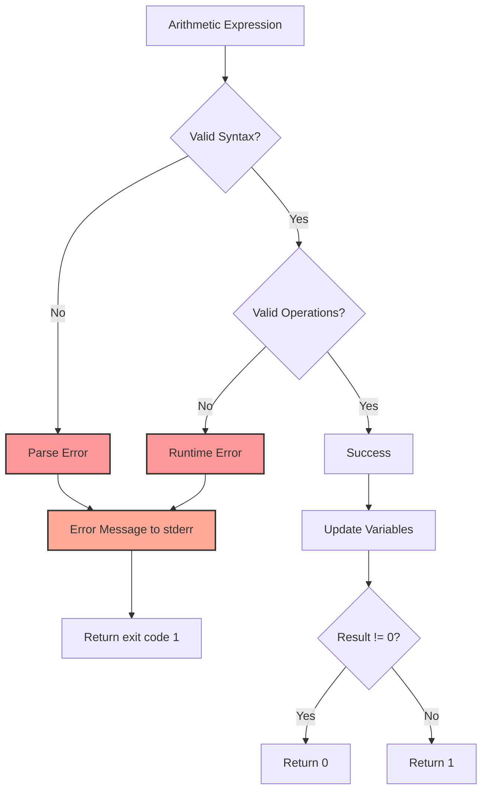

# Arithmetic Command Execution Flow

## Mermaid Diagram

```mermaid
graph TD
    A[Input: ((x = 5))] --> B[Tokenizer]
    B --> C{Token Stream}
    C --> D[DOUBLE_LPAREN Token]
    C --> E[Expression Tokens]
    C --> F[RPAREN RPAREN Tokens]
    
    D --> G[Parser]
    E --> G
    F --> G
    
    G --> H[ArithmeticCommand AST Node]
    H --> I[ExecutorManager]
    I --> J[ArithmeticCommandExecutor]
    
    J --> K[Get Current Variables]
    K --> L[ArithmeticEvaluator]
    L --> M{Evaluate Expression}
    
    M --> N[Update Variables]
    M --> O[Calculate Exit Code]
    
    N --> P[Update Shell State]
    O --> Q{Result != 0?}
    
    Q -->|Yes| R[Return 0]
    Q -->|No| S[Return 1]
    
    style A fill:#f9f,stroke:#333,stroke-width:2px
    style H fill:#bbf,stroke:#333,stroke-width:2px
    style J fill:#bfb,stroke:#333,stroke-width:2px
    style R fill:#9f9,stroke:#333,stroke-width:2px
    style S fill:#f99,stroke:#333,stroke-width:2px
```

## Component Interactions

### 1. Tokenization Phase
- Input: `((x = 5))`
- Output: `[DOUBLE_LPAREN, "x = 5", RPAREN, RPAREN]`
- Responsibility: Recognize `((` as a special token

### 2. Parsing Phase
- Input: Token stream
- Output: `ArithmeticCommand(expression="x = 5")`
- Responsibility: Build AST node with expression content

### 3. Execution Phase
- Input: ArithmeticCommand node
- Process:
  1. Extract current variables from shell state
  2. Evaluate arithmetic expression
  3. Update variables with any assignments
  4. Return appropriate exit code
- Output: Exit status (0 or 1)

## Example Execution Traces

### Example 1: Simple Assignment
```bash
((x = 10))
```
1. Tokenize: `DOUBLE_LPAREN "x = 10" RPAREN RPAREN`
2. Parse: `ArithmeticCommand("x = 10")`
3. Execute: 
   - Evaluate: x = 10, result = 10
   - Update: shell.state.variables['x'] = '10'
   - Return: 0 (because 10 != 0)

### Example 2: Conditional Test
```bash
if ((x > 5)); then echo "big"; fi
```
1. Parse if statement with ArithmeticCommand condition
2. Execute arithmetic command:
   - Evaluate: x > 5 (assuming x = 10), result = 1 (true)
   - Return: 0 (success)
3. If statement proceeds to then branch

### Example 3: Loop with Increment
```bash
i=0
while ((i < 3)); do
    echo $i
    ((i++))
done
```
Each iteration:
- `((i < 3))`: evaluates condition, returns 0 or 1
- `((i++))`: increments i, returns 0

## Error Handling Flow



## Integration with Existing Components

### Shell State Integration
```
ArithmeticCommandExecutor
    |
    v
ShellState
    ├── variables (read/write)
    ├── environment (read-only)
    └── last_exit_code (write)
```

### Control Flow Integration
```
ControlFlowExecutor
    ├── IfStatement
    │   └── condition: ArithmeticCommand
    ├── WhileStatement
    │   └── condition: ArithmeticCommand
    └── UntilStatement
        └── condition: ArithmeticCommand
```