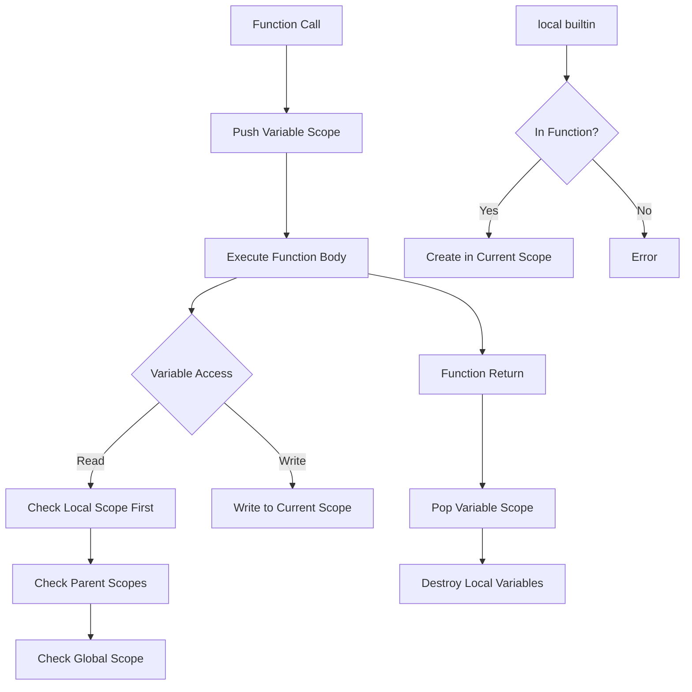

# Local Variable Support Implementation Plan for psh

## Overview

This plan details the implementation of the `local` builtin command for psh, which will provide function-scoped variables matching bash behavior. This is a significant feature that will enhance psh's function capabilities and bring it closer to full bash compatibility.

## Current State Analysis

1. **Variables are currently global**: All variables in psh are either shell variables (in `state.variables`) or environment variables (in `state.env`)
2. **No scope isolation**: Functions can read and modify all variables without restriction
3. **Function infrastructure exists**: We have `FunctionManager` and proper function execution with parameter passing
4. **Builtin architecture ready**: Modular builtin system makes it easy to add new commands

## Implementation Architecture



## Key Components to Implement

### 1. Variable Scope Stack (`psh/core/scope.py`)

```python
class VariableScope:
    """Represents a single variable scope (function-local or global)."""
    def __init__(self, parent=None, name=None):
        self.variables = {}
        self.parent = parent
        self.name = name  # For debugging (function name or 'global')
        
class ScopeManager:
    """Manages the stack of variable scopes."""
    def __init__(self):
        self.global_scope = VariableScope(name='global')
        self.scope_stack = [self.global_scope]
        
    def push_scope(self, name=None):
        """Create new scope for function entry."""
        new_scope = VariableScope(parent=self.current_scope, name=name)
        self.scope_stack.append(new_scope)
        
    def pop_scope(self):
        """Remove scope on function exit."""
        if len(self.scope_stack) > 1:
            return self.scope_stack.pop()
        raise RuntimeError("Cannot pop global scope")
        
    def get_variable(self, name, default=None):
        """Resolve variable through scope chain."""
        # Search from innermost to outermost scope
        for scope in reversed(self.scope_stack):
            if name in scope.variables:
                return scope.variables[name]
        return default
        
    def set_variable(self, name, value, local=False):
        """Set variable in appropriate scope."""
        if local or len(self.scope_stack) == 1:
            # Set in current scope
            self.current_scope.variables[name] = value
        else:
            # Set in global scope (bash behavior for non-local assignments)
            self.global_scope.variables[name] = value
            
    @property
    def current_scope(self):
        """Get the current (innermost) scope."""
        return self.scope_stack[-1]
        
    def is_in_function(self):
        """Check if we're currently in a function scope."""
        return len(self.scope_stack) > 1
```

### 2. Local Builtin (`psh/builtins/shell_state.py`)

```python
@builtin
class LocalBuiltin(Builtin):
    """Create local variables within functions."""
    
    @property
    def name(self) -> str:
        return "local"
    
    def execute(self, args: List[str], shell: 'Shell') -> int:
        # Check if we're in a function
        if not shell.state.scope_manager.is_in_function():
            self.error("local: can only be used in a function", shell)
            return 1
            
        # Parse arguments and create local variables
        # Initial implementation: support basic syntax only
        # local VAR, local VAR=value
        # Future: add -r (readonly), -i (integer), -a (array)
```

### 3. Integration Points

1. **ShellState modifications**:
   - Add `scope_manager: ScopeManager` field
   - Update `get_variable()` to use scope manager
   - Update `set_variable()` to handle scopes
   - Add debug logging for scope operations

2. **Function execution** (`executor/command.py`):
   ```python
   def _execute_function(self, func, args, command):
       # Push new scope
       self.state.scope_manager.push_scope(func.name)
       
       try:
           # ... existing function execution code ...
       finally:
           # Always pop scope, even on exception
           self.state.scope_manager.pop_scope()
   ```

3. **Variable expansion** (`expansion/variable.py`):
   - Use `state.get_variable()` which now handles scopes
   - No changes to expansion syntax needed

## Implementation Phases

### Phase 1: Core Infrastructure (Day 1)
1. Create `psh/core/scope.py` with `VariableScope` and `ScopeManager`
2. Add `scope_manager` to `ShellState`
3. Update variable getter/setter methods with backward compatibility
4. Add debug logging for scope operations
5. Ensure all existing tests pass

### Phase 2: Function Integration (Day 2)
1. Modify `_execute_function()` to push/pop scopes
2. Handle scope cleanup in all exit paths (normal return, FunctionReturn exception)
3. Test nested function calls work correctly
4. Verify variable isolation between functions

### Phase 3: Local Builtin (Day 3)
1. Implement `LocalBuiltin` class in `psh/builtins/shell_state.py`
2. Basic syntax support: `local VAR` and `local VAR=value`
3. Multiple variables: `local var1 var2=value var3`
4. Error checking (must be in function)
5. Add to builtin imports

### Phase 4: Testing & Polish (Day 4-5)
1. Create comprehensive test suite
2. Handle edge cases
3. Add debug output with --debug-scopes flag
4. Update documentation

## Design Decisions

1. **Scope Inheritance**: Local variables WILL be visible to nested function calls (matching bash)
2. **Variable Resolution**: Check scopes from innermost to outermost, then global
3. **Export Behavior**: Local variables cannot be exported (matching bash)
4. **Non-local Assignment**: Assignments without `local` in functions modify global variables
5. **Initial Options**: Start with basic functionality, add -r, -i, -a options later

## Testing Strategy

### New Test Files
1. `tests/test_variable_scopes.py` - Core scope manager functionality
2. `tests/test_local_builtin.py` - Local command behavior  
3. `tests/test_function_locals.py` - Integration with functions

### Core Test Cases

```python
def test_basic_local_variable():
    """Local variable is only visible in function."""
    shell.run_command('''
        myfunc() {
            local myvar="local value"
            echo "$myvar"
        }
        myfunc
        echo "Outside: $myvar"
    ''')
    # Should print "local value" then "Outside: " (empty)

def test_local_shadows_global():
    """Local variable shadows global with same name."""
    shell.run_command('''
        var="global"
        myfunc() {
            local var="local"
            echo "$var"
        }
        myfunc
        echo "$var"
    ''')
    # Should print "local" then "global"

def test_nested_function_sees_outer_local():
    """Inner function can see outer function's locals."""
    shell.run_command('''
        outer() {
            local outer_var="from outer"
            inner() {
                echo "$outer_var"
            }
            inner
        }
        outer
    ''')
    # Should print "from outer"

def test_local_outside_function_error():
    """Using local outside function is an error."""
    result = shell.run_command('local var="test"')
    # Should fail with error message
```

## Debug Support

Add `--debug-scopes` flag to show scope operations:

```
$ psh --debug-scopes
psh$ myfunc() { local x=1; echo $x; }
psh$ myfunc
[SCOPE] Pushing scope for function: myfunc
[SCOPE] Creating local variable: x = 1
[SCOPE] Variable lookup: x found in scope 'myfunc' = 1
1
[SCOPE] Popping scope: myfunc (destroying variables: x)
```

## Success Criteria

1. ✅ All existing tests continue to pass
2. ✅ Local variables behave identically to bash for implemented features
3. ✅ Clean, maintainable code architecture  
4. ✅ Comprehensive test coverage for new functionality
5. ✅ Clear error messages when local used incorrectly
6. ✅ Debug output available for troubleshooting

## Future Enhancements

After initial implementation:
1. Add readonly locals: `local -r CONST=value`
2. Add integer locals: `local -i count=0`
3. Add array locals: `local -a arr=(1 2 3)`
4. Add nameref locals: `local -n ref=other_var`
5. Performance optimizations if needed

## Example Usage After Implementation

```bash
#!/usr/bin/env psh

# Global variable
count=0

increment() {
    local count=10  # Shadow global
    echo "Local: $count"  # Prints: 10
    count=$((count + 1))
    echo "Local after increment: $count"  # Prints: 11
}

increment
echo "Global: $count"  # Prints: 0 (unchanged)

# Nested functions  
outer() {
    local outer_var="outer value"
    
    inner() {
        echo "Can see: $outer_var"  # Sees outer's local
        local inner_var="inner value"
    }
    
    inner
    # echo "$inner_var"  # Would fail - not visible
}

outer

# Multiple declarations
setup() {
    local dir="/tmp/test" file="data.txt" count=0
    echo "Working in $dir with $file"
}
```

## Implementation Notes

1. Start simple - basic local functionality first
2. Ensure backward compatibility at each step
3. Test thoroughly before moving to next phase
4. Keep code readable and well-documented
5. Use debug output to verify correct behavior