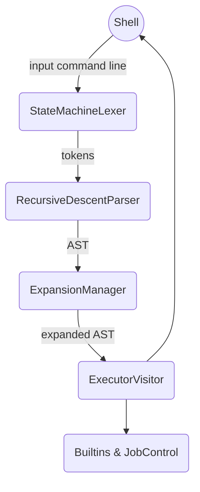
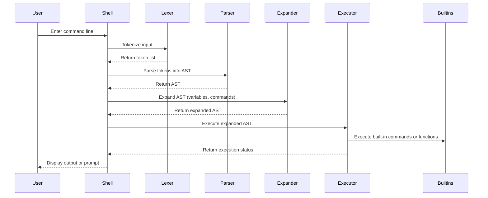

# PSH Architecture and Sequence Diagrams

This document shows high-level architectural diagrams and sequence diagrams for the Python Shell (PSH) codebase.

## Architecture Overview

**Description:**
- **Shell:** The main orchestrator receiving user input or scripts.
- **Lexer:** Tokenizes input preserving quotes, variables, and command substitutions.
- **Parser:** Parses tokens into Abstract Syntax Tree (AST) using recursive descent.
- **ExpansionManager:** Performs variable expansion, command substitution, globbing.
- **ExecutorVisitor:** Executes the expanded AST, managing jobs, redirection, builtins.

## Command Execution Sequence Diagram

This diagram shows the synchronous flow of a command from user input through the core components of the PSH shell.

## Notes

- Each component is modular and extensible.
- Visitor pattern is used in Executor to separate AST processing logic.
- ExpansionManager handles complex shell expansions before execution.
- Asynchronous job management and signal handling occur within Executor and JobControl modules.
